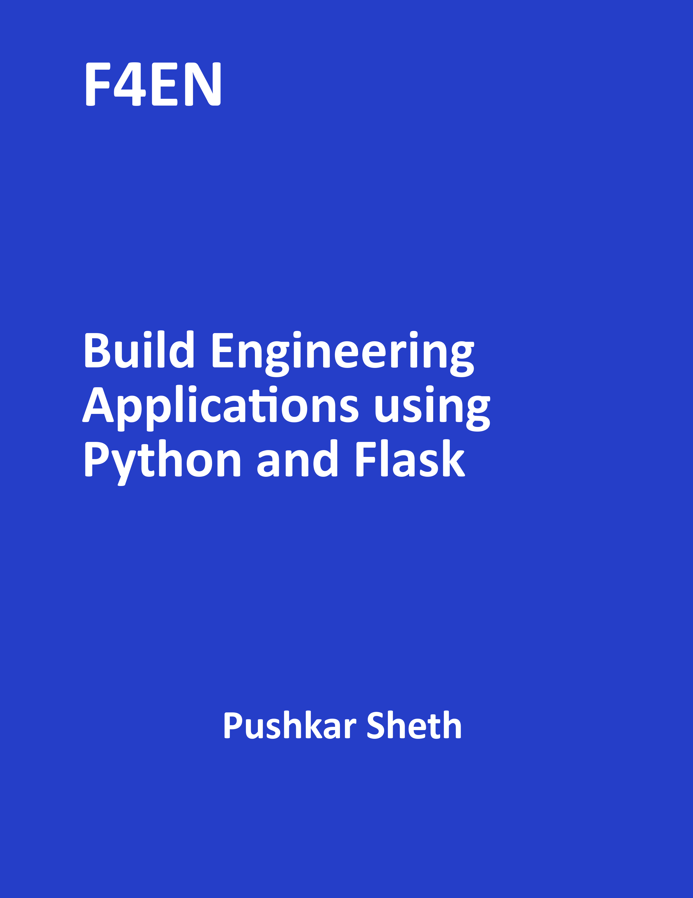

  

**F4EN: Build Engineering Applications using Python and Flask**, Pushkar Sheth

An text book on building engineering applications using python and flask to
be released in November 2020. The eBook book will be available on Amazon Kindle.
